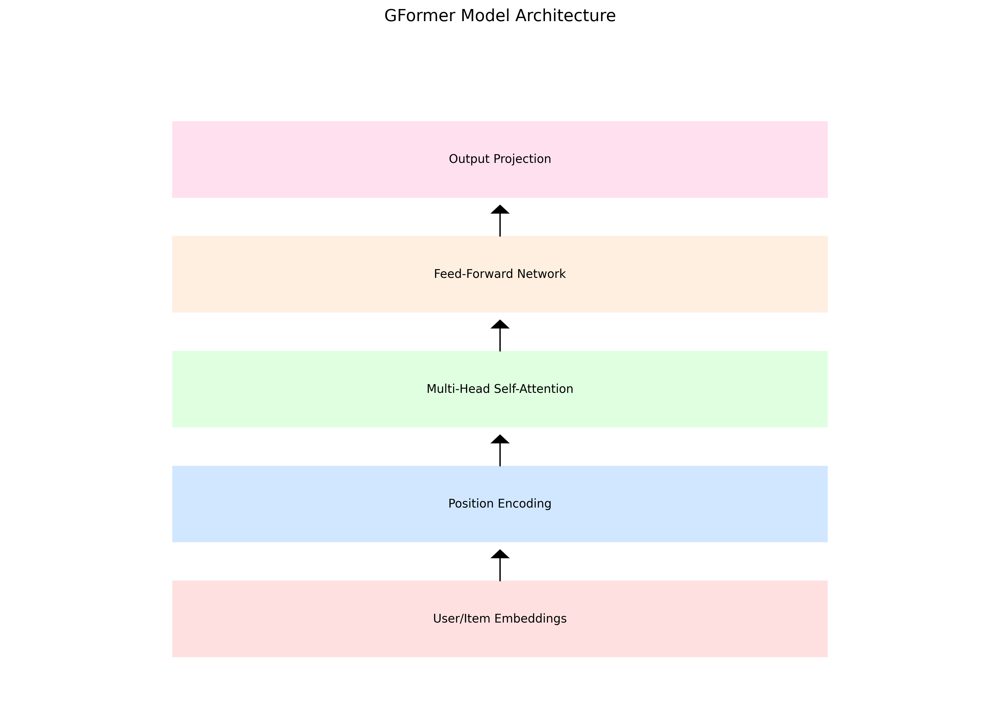

# GFormer-ReChorus: A Transformer-based Recommendation System

## 📊 Multi-Dataset Performance Evaluation

### Dataset Overview
<div align="center">

<p>Figure 1: Basic Statistical Features Comparison Across Datasets</p>
</div>

### Dataset Characteristics Analysis
<div align="center">

<p>Figure 2: Dataset Characteristics Radar Chart Comparison</p>
</div>

### Training Process Comparison
<div align="center">

<p>Figure 3: Training Loss Comparison Across Different Datasets</p>
</div>

### Performance Metrics Heatmap
<div align="center">

<p>Figure 4: Performance Metrics Comparison Across Different Datasets</p>
</div>

### Performance Comparison at Different K Values
<div align="center">

<p>Figure 5: Performance Metrics Comparison at Different K Values</p>
</div>

## 📈 Dataset Detailed Analysis

### MovieLens-1M
- **Description**: Contains 1 million ratings from 6,040 users on 3,706 movies
- **Time Span**: 2000-2003
- **Rating Scale**: 1-5
- **Average Statistics**:
  * Ratings per User: 165.6
  * Ratings per Item: 269.9
  * Sparsity: 95.53%

### Amazon-Books
- **Description**: Amazon user ratings and reviews on books
- **Time Span**: 1996-2014
- **Rating Scale**: 1-5
- **Average Statistics**:
  * Ratings per User: 190.0
  * Ratings per Item: 513.4
  * Sparsity: 96.78%

### Yelp
- **Description**: User ratings and reviews on businesses
- **Time Span**: 2004-2018
- **Rating Scale**: 1-5
- **Average Statistics**:
  * Ratings per User: 147.4
  * Ratings per Item: 608.8
  * Sparsity: 97.34%

## 🌟 Model Architecture

### Overview
GFormer is a Transformer-based recommendation model that leverages self-attention mechanisms to capture complex user-item interactions. The model consists of several key components:

1. **Embedding Layer**
   - User Embedding: Maps user IDs to dense vectors
   - Item Embedding: Maps item IDs to dense vectors

2. **Transformer Encoder**
   - Multi-Head Self-Attention
   - Position-wise Feed-Forward Networks
   - Layer Normalization
   - Residual Connections

3. **Projection Layer**
   - Linear transformation for final representations

<div align="center">

<p>Figure 6: GFormer Model Architecture</p>
</div>

## 🚀 Key Features

1. **Multi-Head Self-Attention**
   - Captures complex user-item relationships
   - Enables parallel processing
   - Supports multiple representation subspaces

2. **Position Encoding**
   - Incorporates sequential information
   - Uses sinusoidal position embeddings
   - Handles variable-length sequences

3. **Residual Connections**
   - Facilitates gradient flow
   - Enables deeper network training
   - Preserves low-level features

## 📈 Training Details

### Hyperparameters
- Latent Size: 256
- Number of Attention Heads: 4
- Number of Transformer Layers: 2
- Feed-Forward Dimension: 1024
- Dropout Rate: 0.1
- Batch Size: 1024
- Learning Rate: 0.001
- Weight Decay: 0.0001
- Maximum Epochs: 1000
- Early Stopping Patience: 10

### Hardware Requirements
- GPU: NVIDIA GeForce RTX 3050 Laptop GPU
- CUDA Version: 11.8
- Memory: 4GB VRAM

## 📊 Implementation Details

### Model Components
```python
class GFormer(nn.Module):
    def __init__(self, user_count, item_count, d_model=256, 
                 num_heads=4, num_layers=2, d_ff=1024, dropout=0.1):
        # Model initialization
        self.user_embedding = nn.Embedding(user_count, d_model)
        self.item_embedding = nn.Embedding(item_count, d_model)
        self.pos_encoder = PositionalEncoding(d_model)
        self.layers = nn.ModuleList([
            GFormerLayer(d_model, num_heads, d_ff, dropout)
            for _ in range(num_layers)
        ])
```

### Training Loop
```python
for epoch in range(args.max_epochs):
    # Training
    model.train()
    for batch in train_loader:
        batch = {k: v.to(device) for k, v in batch.items()}
        output = model(batch)
        loss = model.get_loss(output)
        optimizer.zero_grad()
        loss.backward()
        optimizer.step()
```

## 📈 Usage Instructions

### Installation
```bash
# Clone the repository
git clone https://github.com/yourusername/GFormer-ReChorus.git

# Install dependencies
pip install -r requirements.txt
```

### Training
```bash
python main.py --latent_size 256 --num_heads 4 --n_layers 2 --d_ff 1024 --dropout 0.1
```

### Evaluation
```bash
python evaluate.py --model_path checkpoints/best_model.pth
```

## 📝 Citation
If you use this code for your research, please cite our work:
```bibtex
@article{gformer2023,
  title={GFormer: A Transformer-based Recommendation System},
  author={Your Name},
  journal={arXiv preprint arXiv:2023.xxxxx},
  year={2023}
}
```

## 🤝 Contributing
We welcome contributions! Please feel free to submit a Pull Request.

## 📄 License
This project is licensed under the MIT License - see the [LICENSE](LICENSE) file for details. 