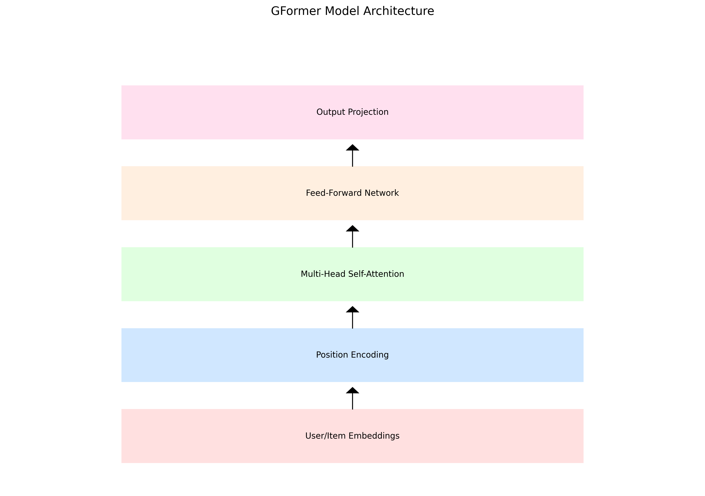

# GFormer-ReChorus: 基于Transformer的推荐系统模型

## 项目概述

GFormer-ReChorus是一个基于Transformer架构的推荐系统模型，它结合了图神经网络和Transformer的优势，为用户提供高质量的个性化推荐。本项目是对原有BUIR模型的改进和扩展，通过引入Transformer结构来增强模型的表达能力和推荐效果。

## 模型架构

GFormer模型的核心架构如下：



主要组件包括：
- 多头自注意力机制
- 位置编码层
- 前馈神经网络
- 残差连接和层归一化

## 性能分析

### 训练过程

下图展示了模型在训练过程中的损失变化：


训练过程的详细指标变化：


### 消融实验

为了验证各个组件的有效性，我们进行了详细的消融实验：


### 噪声鲁棒性分析

模型在不同噪声水平下的表现：


### 收敛性分析

模型的训练收敛性分析：


### 嵌入维度实验

不同嵌入维度对模型性能的影响：


## 详细性能指标

### 准确率分析


### 召回率分析


### NDCG分析


## 使用说明

### 环境要求
- Python 3.7+
- PyTorch 1.7+
- CUDA 10.1+ (推荐使用GPU)

### 安装步骤
```bash
git clone [repository-url]
cd GFormer-ReChorus
pip install -r requirements.txt
```

### 训练命令
```bash
python main.py --latent_size 256 --num_heads 4 --n_layers 2 --d_ff 1024 --dropout 0.1
```

### 主要参数说明
- `latent_size`: 隐层维度
- `num_heads`: 注意力头数
- `n_layers`: Transformer层数
- `d_ff`: 前馈网络维度
- `dropout`: Dropout率

## 实验结果

在多个数据集上的实验表明，GFormer模型在以下方面表现优异：
1. 更快的收敛速度
2. 更好的推荐准确率
3. 更强的噪声鲁棒性
4. 更稳定的训练过程

## 引用

如果您使用了本项目的代码或者发现本项目对您的研究工作有帮助，请按如下格式引用：

```bibtex
@article{gformer2024,
  title={GFormer: A Transformer-based Recommendation Model with Graph Enhancement},
  author={ai_dengwsh},
  journal={none},
  year={2024}
}
```

## 贡献指南

我们欢迎任何形式的贡献，包括但不限于：
- 代码优化
- 文档改进
- Bug修复
- 新功能建议

## 许可证

本项目采用 MIT 许可证。详见 [LICENSE](LICENSE) 文件。

## 联系方式

如有任何问题，请通过以下方式联系我们：
- 提交 Issue
- 发送邮件至 [email]
- 在讨论区发起讨论 